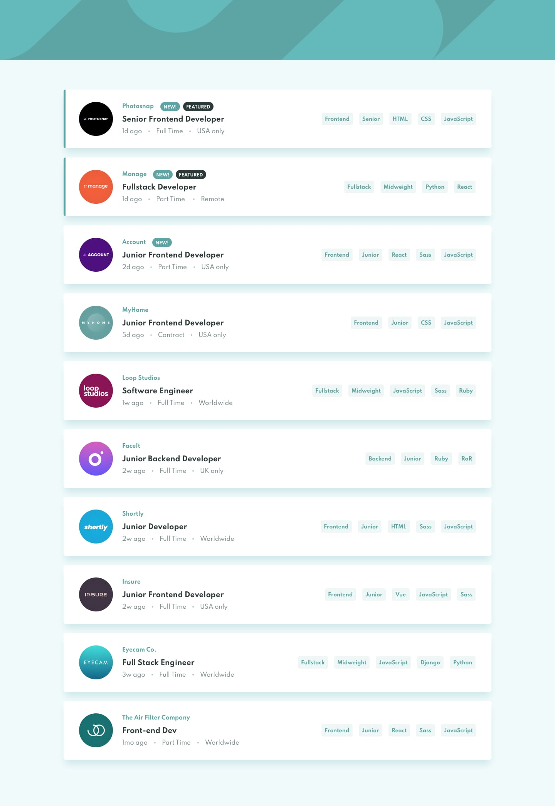
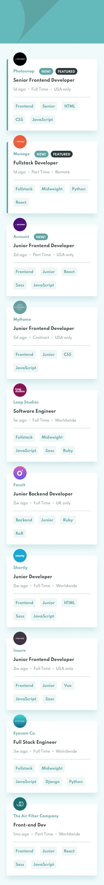
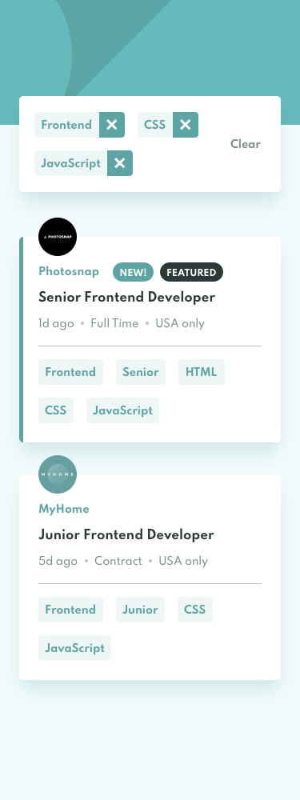

# fm-job-listings-with-filtering (Job Listing with Filtering)

## Live Preview

Live Preview: [https://nitearie.github.io/fm-job-listings-with-filtering/](https://nitearie.github.io/fm-job-listings-with-filtering/)

## Design

> Desktop

> Desktop Active State

> Mobile

> Mobile Filter

## General

My challenge is to build out this job listing page and get it looking as close to the design as possible.

My users should be able to:

- View the optimal layout for the site depending on their device's screen size
- See hover states for all interactive elements on the page
- Filter job listings based on the categories